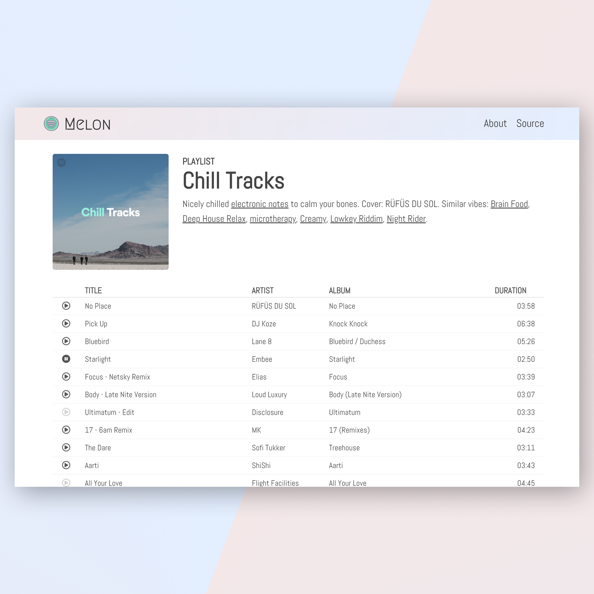

# Melon (a.k.a. react-spotify-client)
#### Can't decide on what to listen to? Melon makes it easy to find the right music for the right moments.

This project was created as an adaptation of the app created in the [React Tutorial](https://www.youtube.com/playlist?list=PLqGj3iMvMa4LFqyGab_aR7M0zfQm2KTuX) of the DevTips Channel. The application retrieves data from the Spotify Web API. The React front-end is integrated with a simple Express server, the code for which could be found [here](https://github.com/leemun1/react-spotify-server) 

#### Check out the App here: [Live Preview](https://spotify-leemun1-client.herokuapp.com/)

## Made with
- React
- Redux
- Sass
- Spotify Web API

## Setup
### 1. Start the server
- `git clone git@github.com:leemun1/react-spotify-server.git`
- `cd react-spotify-server`
- `yarn install`
- `yarn start`

### 2. Start the client
- `git clone git@github.com:leemun1/react-spotify-client.git`
- `cd react-spotify-client`
- `yarn install`
- `yarn start`
- visit [http://localhost:3000](http://localhost:3000)
